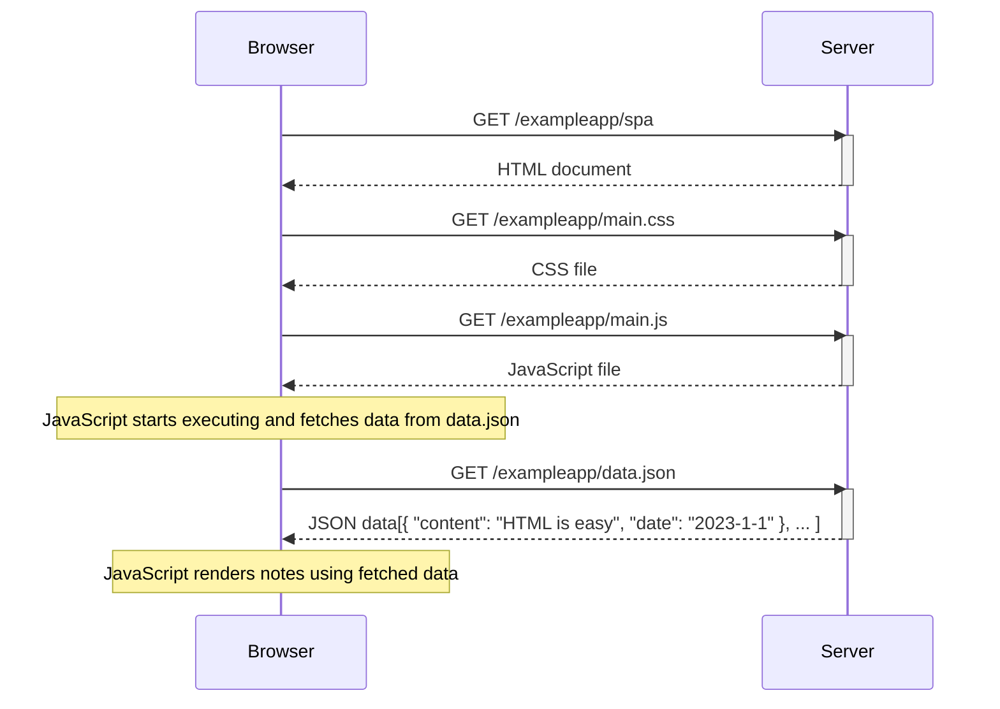

```mermaid
    sequenceDiagram
        participant Browser
        participant Server

        Browser->>Server: GET /exampleapp/spa
        activate Server
        Server-->>Browser: HTML document
        deactivate Server

        Browser->>Server: GET /exampleapp/main.css
        activate Server
        Server-->>Browser: CSS file
        deactivate Server

        Browser->>Server: GET /exampleapp/main.js
        activate Server
        Server-->>Browser: JavaScript file
        deactivate Server
        Note over Browser: JavaScript starts executing and fetches data from data.json

        Browser->>Server: GET /exampleapp/data.json
        activate Server
        Server-->>Browser: JSON data[{ "content": "HTML is easy", "date": "2023-1-1" }, ... ]
        deactivate Server
        Note over Browser: JavaScript renders notes using fetched data
```