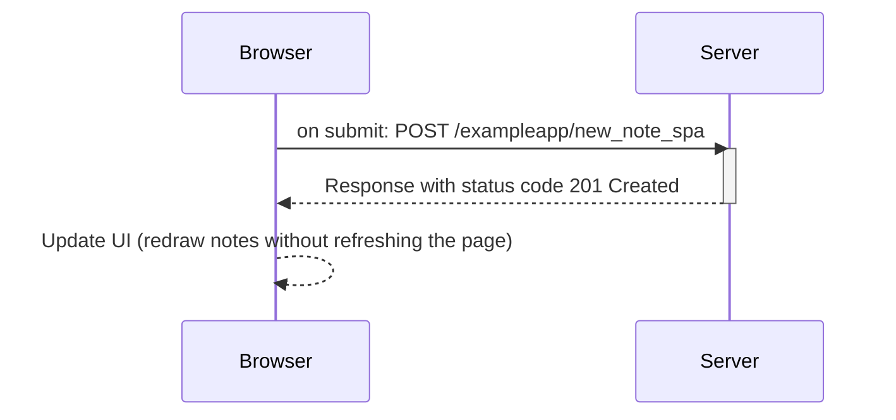

```mermaid
    sequenceDiagram
        participant Browser
        participant Server

        Browser->>Server: on submit: POST /exampleapp/new_note_spa
        activate Server
        Server-->>Browser: Response with status code 201 Created
        deactivate Server
        
        Browser-->>Browser: Update UI (redraw notes without refreshing the page)
```